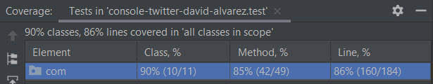

<h1>ConsoleTwitter</h1>
  
Implementation of a console-based social networking application (similar to Twitter) satisfying the scenarios below.  
  
<h2>Scenarios</h2>  
  
 Posting: Alice can publish messages to a personal timeline  
   
```  
> Alice -> I love the weather today  
> Bob -> Damn! We lost!  
> Bob -> Good game though.  
```  
  Reading: Bob can view Alice’s timeline  
   
```  
> Alice  
I love the weather today (5 minutes ago)  
> Bob  
Good game though. (1 minute ago)  
Damn! We lost! (2 minutes ago)  
```  
  
  Following: Charlie can subscribe to Alice’s and Bob’s timelines, and view an aggregated list of all subscriptions  
   
```  
> Charlie -> I'm in New York today! Anyone want to have a coffee?  
> Charlie follows Alice  
> Charlie wall  
Charlie - I'm in New York today! Anyone want to have a coffee? (2 seconds ago)  
Alice - I love the weather today (5 minutes ago)  
  
> Charlie follows Bob  
> Charlie wall  
Charlie - I'm in New York today! Anyone wants to have a coffee? (15 seconds ago)  
Bob - Good game though. (1 minute ago)  
Bob - Damn! We lost! (2 minutes ago)  
Alice - I love the weather today (5 minutes ago)  
```  
  
<h2>Details</h2>  
  
* The application uses the console for input and output.  
* Users submit commands to the application.   
* There are four commands. “posting”, “reading”, etc. are not part of the commands.  
* Commands always start with the user’s name.  
* posting: user name -> message  
* reading: user name  
* following: user name follows another user  
* wall: user name wall   

<h2>How to run the application</h2>  

* Clone the repository.
* Enter repository folder.
* Run the app with:
`.\gradlew run -q --console=plain` in Windows or
`./gradlew run -q --console=plain` in Linux.
* Alternatively you can also run from within the IDE:
Load the class  `com.lookiero.ConsoleTwitter`  and run the  `main()`  function.
* To stop the app, `press Ctrl + C`

<h2>Tests</h2>  

A series of tests have been added with the following coverage:



To run the tests, execute `.\gradlew test` (`./gradlew test` in Linux)

Report is generated in `.\consoletwitter\build\reports\tests\test\index.html`